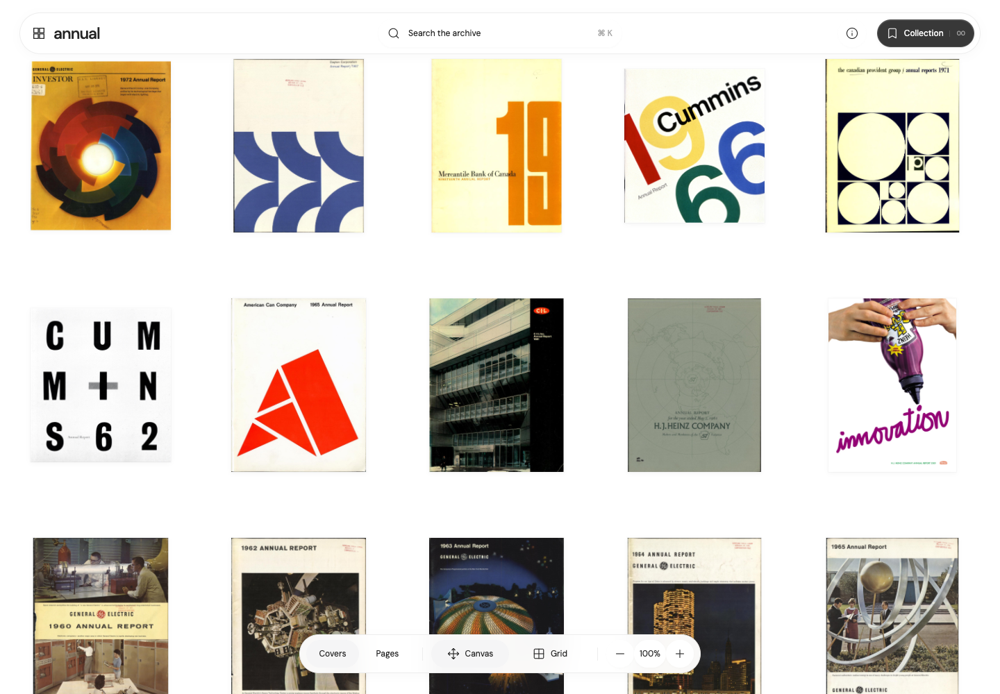

# Annual Archive

An infinite canvas for exploring the graphic design of annual reports. Browse **3,007 reports**, open their pages inline, and search by company, typography, layout, or visual style.

Built with **Astro · TypeScript · StyleX · Three.js**.



## Explore

- **Covers or pages.** Switch the home canvas between report covers and available page scans.
- **Canvas or grid.** Pan and zoom freely, or browse an ordered grid. The same image elements move between layouts.
- **Read inline.** Open a report, browse horizontally, see all pages, or bring one page into focus. Report links preserve the selected report.
- **Command search.** Press `⌘K` / `Ctrl+K` or `/` to find a report or page. Selecting a result opens it; searching leaves the background canvas unchanged.
- **Personal collection.** Save reports locally in your browser. No account required.
- **Artwork-led loading.** Covers fan out, then settle into the canvas. Reveals wait for visible WebGL texture coverage and a rendered frame, with a bounded fallback for unavailable assets.

Keyboard navigation, focus management, reduced motion, and image fallback are supported. Arrow keys pan a focused canvas or turn pages in Read mode; Escape returns from focused reading and dismisses dialogs.

## Run locally

Requires **Node.js 22.12+** and npm.

```sh
git clone https://github.com/caelinsutch/annual-archive-canvas.git
cd annual-archive-canvas
npm ci
npm run dev
```

Open [localhost:3000](http://localhost:3000).

No API key or database is required. Semantic search downloads its models on first use, so the first query can take longer. Models are cached in `work/models`; set `MODEL_CACHE_DIR` to use another writable location.

### Production

```sh
npm run build
npm start
```

Deploy as a **Node service**, using `npm ci && npm run build` as the build command and `npm start` as the start command. `PORT` defaults to `3000`. Source adapters and search inference run on the server; this is not a static-only deployment. Allow outbound access to source collections and model downloads, and keep the model cache persistent where possible.

## Search

**Report search** combines lexical matching with BGE-small-en-v1.5 text embeddings of catalogue names, descriptions, designers, industries, and colors. All 3,007 reports are indexed.

**Page search** uses CLIP image/text embeddings of actual scans, with suggested tags for page role, layout, typography, imagery, palette, and style. The committed visual index contains **10,660 pages across 401 reports**. This includes 7,968 downloaded page scans from 314 complete PDF reports. It covers processed scans, not every page in the catalogue; tags are suggestions rather than verified classifications.

Query inference runs on the Node server. Bulk indexing is a separate job:

```sh
npm run index:catalog
npm run index:pages

# Optional: include PDF pages in a targeted batch; requires Poppler's pdftoppm.
INCLUDE_PDFS=1 REPORT_IDS=uw43767 npm run index:pages
```

Page indexing resumes from the committed index. `REPORT_IDS` and `PAGE_LIMIT` can limit a batch. Cloud-worker indexing is not configured.

## Checks and evaluations

```sh
npm test                    # Unit, catalogue, source, and search regression tests
npm run build               # Type checking and production build
npm run eval:check          # Text and visual retrieval quality thresholds

# With the app running locally:
TEST_URL=http://localhost:3000 npm test
npm run test:browser
npm run test:command
npm run test:motion
npm run test:loader
```

Browser checks require the [agent-browser CLI](https://github.com/vercel-labs/agent-browser) and its Chromium installation. They cover persistent image nodes, report transitions, keyboard navigation, responsive controls, reduced motion, and WebGL loading readiness.

Search fixtures and results live in [`benchmarks/`](benchmarks/). Text evaluation uses 20 editorial queries split into development and held-out sets. Visual evaluation uses ten inspected queries within the Cummins 1966 report, plus four known-page queries across four newly downloaded reports. These are small regression benchmarks, not a comprehensive relevance study. Run `npm run eval:search` or `npm run eval:pages` for individual results.

## Project structure

| Path | Purpose |
| --- | --- |
| `src/client/` | Canvas rendering, navigation, dialogs, and motion |
| `src/components/` | Astro interface markup |
| `src/styles/` | StyleX components, design tokens, and global styles |
| `src/pages/api/` | Source resolution, image/PDF proxies, and search endpoints |
| `src/search/` | Text and visual embeddings, ranking, and taxonomy |
| `public/` | Catalogue, search indexes, thumbnails, and source data |
| `scripts/` | Indexing, evaluation, and browser QA |
| `docs/` | Source provenance and catalogue audits |

## Sources and credits

The original catalogue and cover images come from Phil Hedayatnia's [Annual Report Archive](https://annualreport.gallery/). Additional New York Airways reports come from [Columbia University Libraries](https://library.columbia.edu/libraries/business/corpreports.html). The interface also takes inspiration from [Cosmos](https://www.cosmos.so/) and the artwork-led intro at [Printed Archive](https://printed-archive.vercel.app/).

Readers resolve public scans and PDFs from sources including Internet Archive, University of Washington CONTENTdm, Texas History IIIF, and Paul Rand's archive. Availability varies by collection. When full pages cannot be retrieved, the report retains its attributed cover and source link. The server accepts only cover paths and PDF URLs associated with known catalogue records.

Report names received a machine-assisted cover-text audit across all 3,007 entries. See the [name audit](docs/catalog-name-audit.md), [correction log](docs/catalog-name-corrections.json), and [source discovery notes](docs/source-discovery.md) for evidence and remaining limitations.

Report artwork, scans, and catalogue descriptions belong to their respective rights holders. Their inclusion here does not grant a new license to those materials.

### Expand downloaded page coverage

```sh
# Download up to 100 more verified PDF reports, embed their pages, and run checks.
npm run expand:pages

# Process all remaining verified PDFs, or preview a smaller batch.
npm run expand:pages -- --all
npm run expand:pages -- --limit 25 --dry-run

# Retry or target particular catalogue reports.
npm run expand:pages -- --ids uw43767,paulrand-ibm-1980
```

Install Poppler first (`brew install poppler` on macOS); Node dependencies come from `npm install`. Models download on first use, with no API key required. Use `--help` for options, including download concurrency and timeout.

The workflow downloads PDFs from existing verified source manifests, validates their signatures and page counts, and saves 1,600-pixel reading images plus 600-pixel thumbnails. It then resumes CLIP embeddings, runs all three search evaluations and cached-page integrity checks, and updates the coverage count in this README. It does not discover new source URLs or guarantee access to every catalogue report.

Completed downloads and embeddings are reused on subsequent runs. Each run writes logs, download outcomes, and a final summary under `work/expansions/`. Failed sources produce a retry command and exit code 2 after successful pages are indexed and checked. An active lock prevents overlapping workflow runs; after an interrupted run, check that its recorded process has stopped before removing `work/expansions/active.lock`.

Original PDFs stay in the ignored `work/pdf-cache/` directory. Deployable images, manifests, and the visual index live in `public/`; provenance and SHA-256 checksums are recorded in `docs/page-cache-expansion.json`. Review and commit these generated files, then rebuild/restart the production server (`npm run build` followed by `npm start`) or redeploy to serve the expanded collection. The workflow does not commit or deploy automatically.

For individual stages, `npm run cache:pages`, `npm run index:pages`, and `npm run eval:check` remain available.
